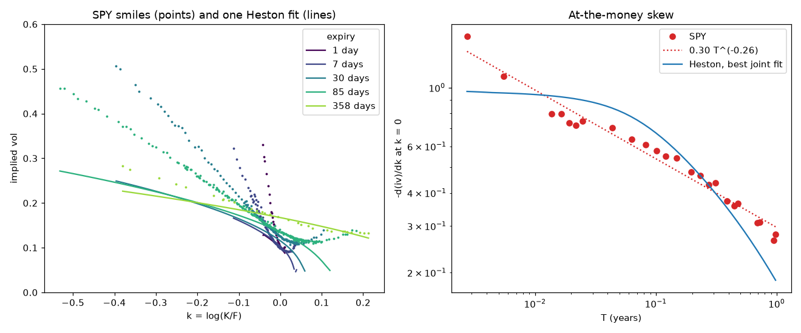

# volsurface

Pull an option chain, turn it into an implied volatility surface, and price it under
Black-Scholes, Heston, SABR and rough Bergomi through one interface.



The left panel shows SPY implied vols on 7 October 2026 (points) and the best single Heston
fit to their at-the-money levels and skews (lines). The right panel is the reason this
repository exists: the market's at-the-money skew grows like a power of $1/T$ as expiry
shrinks, while Heston's flattens to a constant. Rough volatility models predict the power
law. The sessions below work towards pricing them.

## Why

Part of my preparation for a DPhil in mathematical finance. Each session asks one question,
answers it with an interactive figure, and builds on the last. See [ROADMAP.md](ROADMAP.md)
for the ladder and [LOG.md](LOG.md) for what each session found.

## Run it

Uses the shared environment in `~/phd/.venv` (Python 3.11).

```bash
source ~/phd/.venv/bin/activate
pip install -e ".[dev]"                      # once
marimo run sessions/00_the_smile.py          # the app: sliders, surface, smile
marimo edit sessions/00_the_smile.py         # the same, with the code
pytest -m "not slow"                         # tests; add --impl exercises for your own code
```

Without Python, open the static export: [docs/00_the_smile.html](docs/00_the_smile.html).

Fetch a new snapshot (during US market hours for mid quotes; outside them the yfinance
backend falls back to the last session's trade prices):

```bash
python -m volsurface.chains yfinance SPY     # writes data/snapshots/SPY_<date>.parquet
python -m volsurface.chains ibkr SPY         # needs IB Gateway or TWS; see .env.example
```

## Layout

| Path | Contents |
|---|---|
| `volsurface/bs.py` | Black-Scholes in forward form, Greeks, vectorised implied vol |
| `volsurface/heston.py` | Heston characteristic function (trap-free form), Fourier prices, Euler simulation |
| `volsurface/models.py` | The `Model` interface and `implied_surface`; every model plugs in here |
| `volsurface/chains.py` | Option chains from yfinance or IBKR, snapshots, forwards, market implied vols |
| `volsurface/smile.py` | At-the-money level and skew, power-law fits |
| `sessions/` | marimo apps, one per session |
| `tests/` | pytest; mathematical tests run against `volsurface/` or `exercises/` |
| `data/snapshots/` | committed option chain snapshots (parquet) |
| `docs/` | static exports and the README figure (`python docs/figure_00.py`) |

## Found so far

- **Session 00.** SPY's at-the-money skew follows $|\psi(T)| \approx 0.30\, T^{-0.26}$ from
  one day to one year. No single Heston parameter set reproduces both ends: the best joint
  fit puts $\rho$ at its bound of $-0.99$ and still gives a one-day skew of 1.0 against the
  market's 1.6.

## Licence

MIT.
